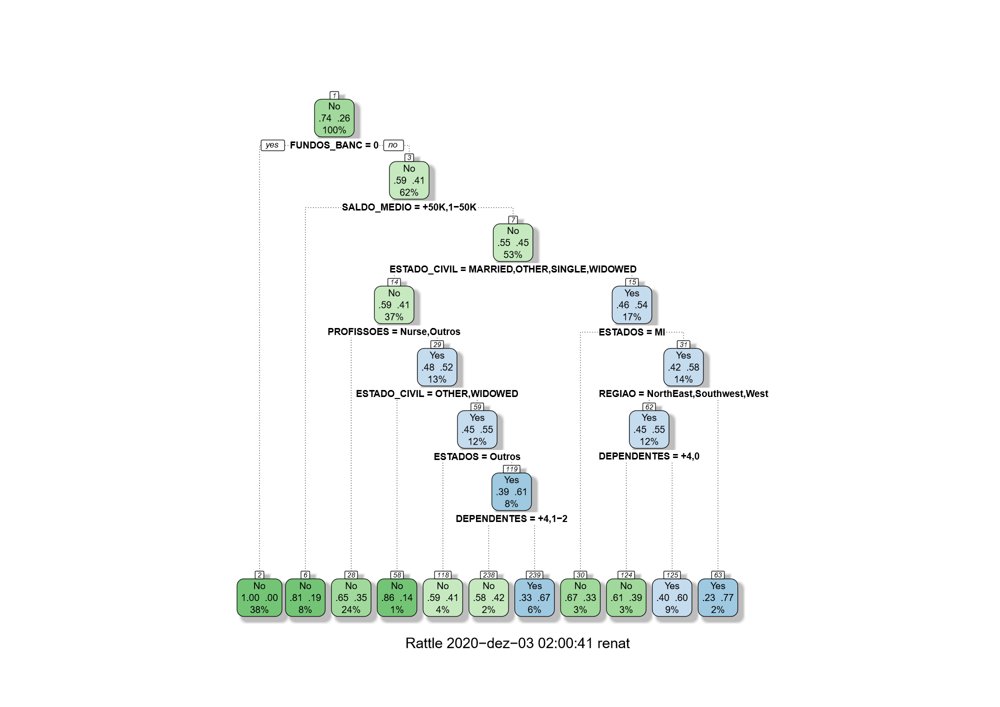

# CES-30_Prova2

---

Versão do RStudio utilizada: 1.2.1568

---

Para executar o código, basta mandar rodar o script 'mineracao.R'. 

Automaticamente ele chama os scripts 'exploracao.R','carregamento_dados.R' e 'instalando_bibli.R'

---

Após rodar o código, encontrou-se três árvores de decisão com precisão e acurácia acima de 75%, sendo escolhida a de maior precisão, conforme pode ser visto na imagem abaixo:

Árvore escolhida:

